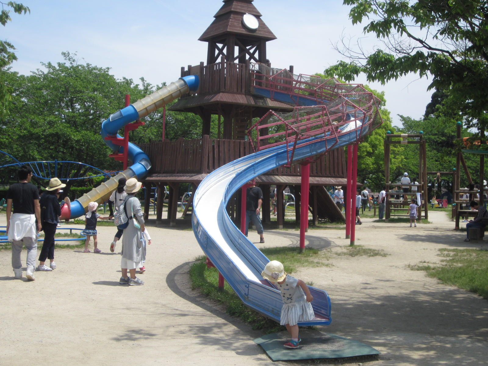
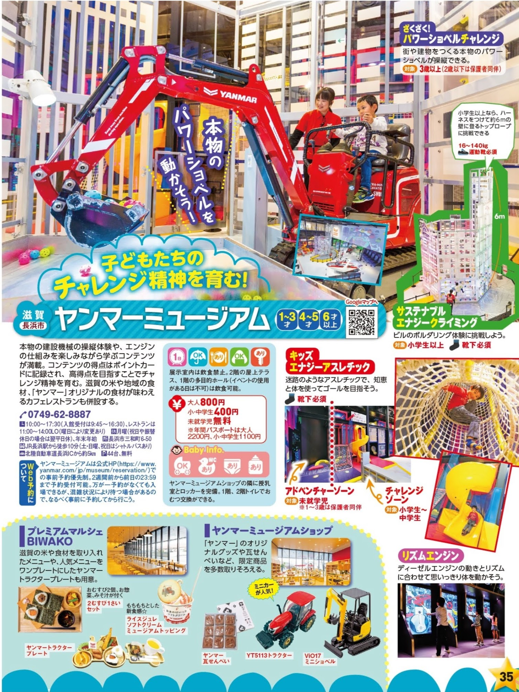

- [DAY1: 2024年4月27日(土)](day1.md)
- [DAY2: 2024年4月28日(日)](day2.md)
- [DAY3: 2024年4月29日(月・祝)](day3.md)

---

# DAY1: 2024年4月27日(土)

<a href="https://maps.app.goo.gl/PTtouJmtQseYw7Jm7">
    
</a>

# [ヤンマーミュージアム](https://www.yanmar.com/jp/museum/)

- 自宅から🚗127km
- 駐車場44台 無料
- 10am-2pmの約4時間滞在予定



```
滋賀県長浜市三和町6-50
TEL: 0749-62-8887 / FAX: 0749-62-8780

≪土日祝日≫
10:00-17:30（受付 9:45-16:30）※最終入館17:00
```


# 昼食

- ヤンマーミュージアム併設カフェで
- 土日は混雑するらしいので早めに

<div style="text-align: center;">
    
    
    
</div>

```
【平日】11:00～14:30（ラストオーダー 14:00）
【土日祝日】11:00～17:00（ランチラストオーダー 15:00 / カフェラストオーダー 16:30）
```

# [あわら温泉 青雲閣](https://yukai-r.jp/seiunkaku/)

- ヤンマーミュージアムから🚗127km
- 早めにチェックインして館内のキッズパークで遊ぶ

```
【施設名】　あわら温泉 青雲閣
【所在地】〒910-4103 福井県あわら市二面68-1
【電話番号】0570-550-078
```


```
 ○チェックイン日時：2024年4月27日(土)　15時00分
 ○泊数　　　　　　：1泊
 ○部屋数　　　　　：1部屋
 ○部屋タイプ　　　：スタンダード和室 風呂あり
 ○喫煙区分　　　　：禁煙
 ○プラン名　　　　：【1泊2食付】和洋中の多彩なバイキングを満喫できる基本プラン※北陸応援割対象外プラン
 ○食事有無　　　　：夕食 朝食
 ```

```
-----------------------------------------------------------
<料金明細> ※消費税込
-----------------------------------------------------------
<1泊目>(4/27:土)
■1部屋目：
【大人】2名　　(男性:1名　女性:1名)
　　(19,931円)×2名　=　39,862円
小学生
　　(18,841円)×1名　=　18,841円
幼児（3歳以上）
　　(18,531円)×1名　=　18,531円
----------------------------------------
【小計金額】　77,234円
【入湯税】　300円(150円×大人2名×1日)
----------------------------------------
【合計金額】　77,534円
-----------------------------------------------------------
```

---

- [DAY1: 2024年4月27日(土)](day1.md)
- [DAY2: 2024年4月28日(日)](day2.md)
- [DAY3: 2024年4月29日(月・祝)](day3.md)