- [DAY1: 2024年4月27日(土)](day1.md)
- [DAY2: 2024年4月28日(日)](day2.md)
- [DAY3: 2024年4月29日(月・祝)](day3.md)

---

# DAY1: 2024年4月27日(土)

<div style="text-align: center;">
    <a href="https://maps.app.goo.gl/J2sErkKzkRhZ9QyC9" target="_blank">
        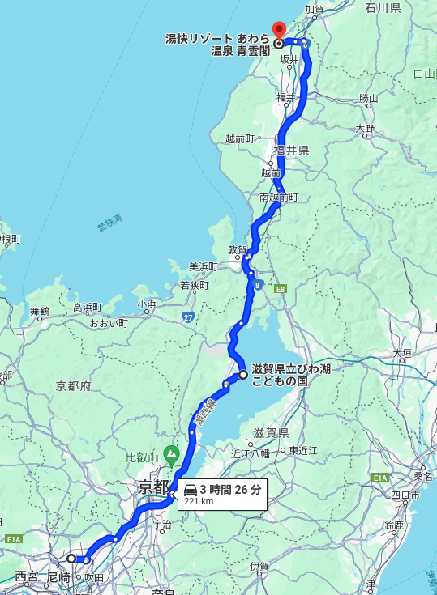
    </a>
    <a href="https://search.w-nexco.co.jp/forecast/trafficjam_golden_week_2024/book/#target/page_no=3" target="_blank">
        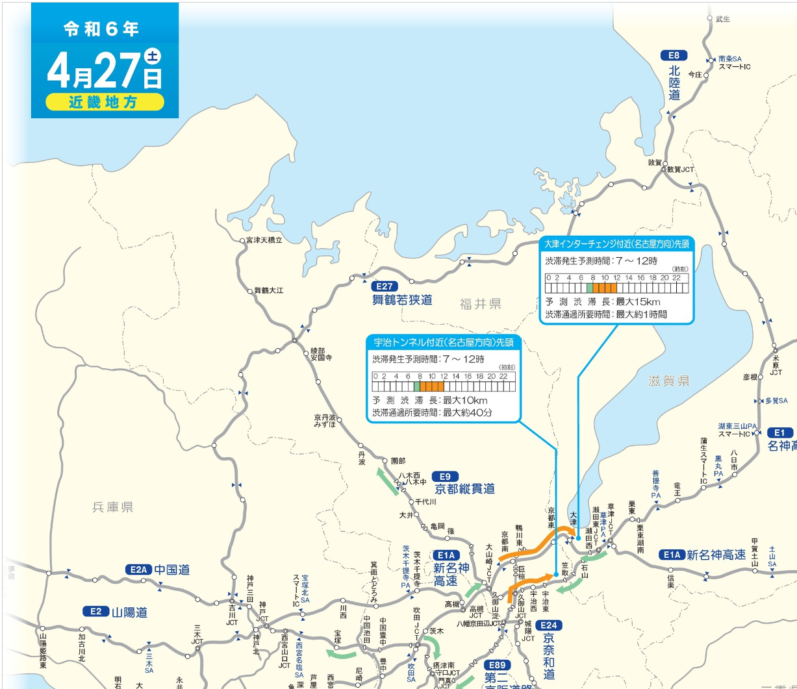
    </a>
</div>

# 昼食

朝の名神高速(京都南〜大津)の渋滞具合により、昼食の時間帯どこにいるか不明のため、未定

## 候補

- 滋賀県 [道の駅 妹子の郷](https://imokonosato.com/)
- 滋賀県 [道の駅 藤樹の里あどがわ](https://adogawa.net/)
- びわ湖こどもの国にもレストランはある
- 福井県 [道の駅 南えちぜん山海里](https://kineno-nanjo.com/)

# [びわ湖こどもの国](http://www.biwa.ne.jp/~kodomo92/)

- 自宅付近から [🚗90〜110km](https://maps.app.goo.gl/FMVV52ojrkVi221ZA)
- 駐車場200台(普通車1台1回500円)
- 営業時間（3月〜 5月）9：00〜18：00

<div style="text-align: center;">
    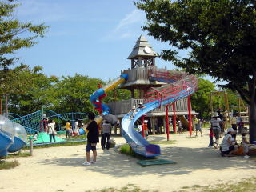
    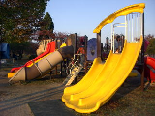
    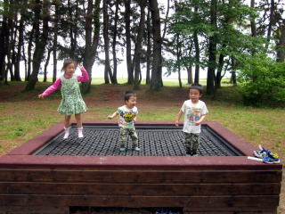
</div>
<div style="text-align: center;">
    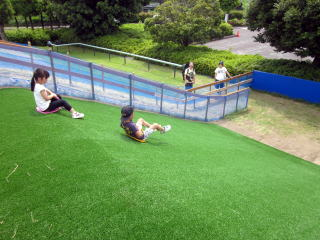
    
    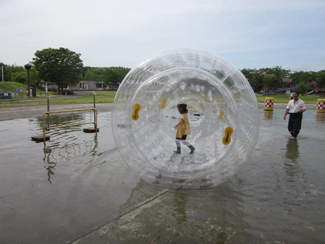
</div>

- 遊具などの紹介をしているブログ: [こどもとお出かけ｜滋賀【びわ湖こどもの国】は本当にすごい公園](https://kuragebohemian.xyz/cat/child/park11)

# [道の駅 南えちぜん山海里](https://kineno-nanjo.com/)

- 南条SAから徒歩で入れる
- 時間があれば寄りたい
- 屋外遊具(建物3階からのローラー滑り台など)・屋内キッズスペースあり

<div style="text-align: center;">
    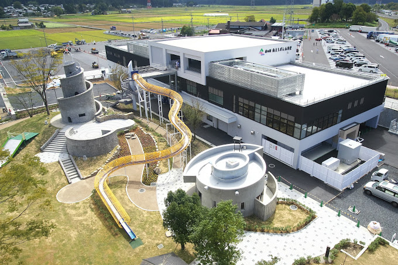
    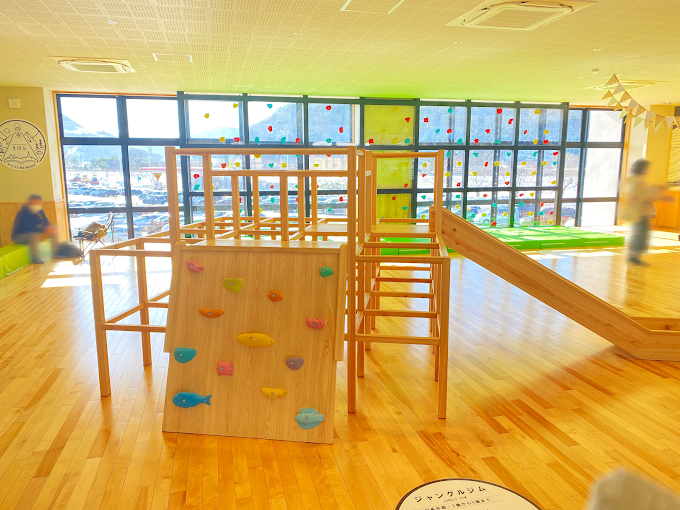
    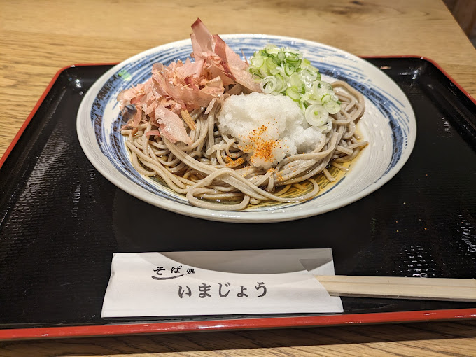
</div>

# [あわら温泉 青雲閣](https://yukai-r.jp/seiunkaku/)

- びわ湖こどもの国から [🚗128km](https://maps.app.goo.gl/Txc4xBBBC3qkj9dT6)
- 早めにチェックインして館内のキッズパークで遊ぶ

```
【施設名】　あわら温泉 青雲閣
【所在地】〒910-4103 福井県あわら市二面68-1
【電話番号】0570-550-078
```

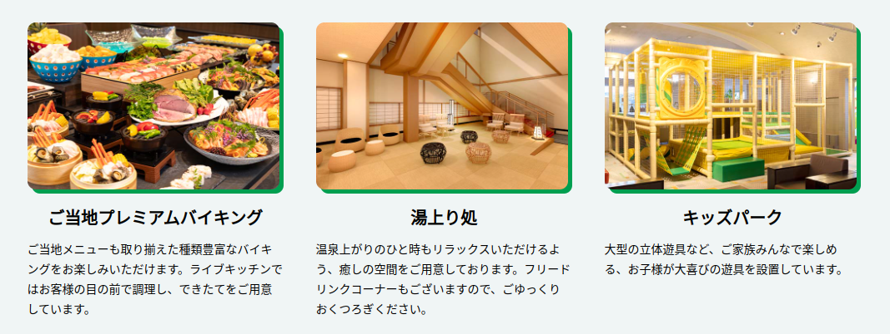

```
 ○チェックイン日時：2024年4月27日(土)　15時00分
 ○泊数　　　　　　：1泊
 ○部屋数　　　　　：1部屋
 ○部屋タイプ　　　：スタンダード和室 風呂あり
 ○喫煙区分　　　　：禁煙
 ○プラン名　　　　：【1泊2食付】和洋中の多彩なバイキングを満喫できる基本プラン※北陸応援割対象外プラン
 ○食事有無　　　　：夕食 朝食
 ```

```
-----------------------------------------------------------
<料金明細> ※消費税込
-----------------------------------------------------------
<1泊目>(4/27:土)
■1部屋目：
【大人】2名　　(男性:1名　女性:1名)
　　(19,931円)×2名　=　39,862円
小学生
　　(18,841円)×1名　=　18,841円
幼児（3歳以上）
　　(18,531円)×1名　=　18,531円
----------------------------------------
【小計金額】　77,234円
【入湯税】　300円(150円×大人2名×1日)
----------------------------------------
【合計金額】　77,534円
-----------------------------------------------------------
```

---

- [DAY1: 2024年4月27日(土)](day1.md)
- [DAY2: 2024年4月28日(日)](day2.md)
- [DAY3: 2024年4月29日(月・祝)](day3.md)