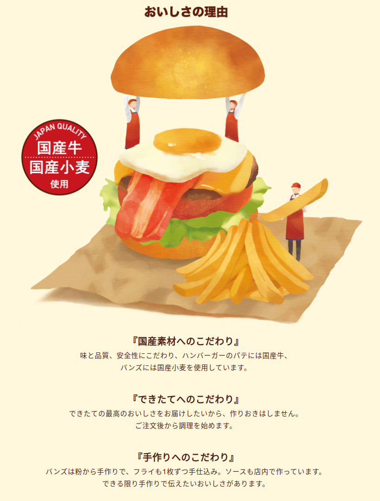

- [DAY1: 2024年4月27日(土)](day1.md)
- [DAY2: 2024年4月28日(日)](day2.md)
- [DAY3: 2024年4月29日(月・祝)](day3.md)

---

# DAY2: 2024年4月28日(日)

# 午前

- 青雲閣で朝食ビュッフェを食べて出発
- 海岸で待ち合わせて[磯遊び](https://fuku-iro.jp/feature/detail_136.html#1034)？(天候による)

- ウミウシ、アメフラシ、ウニ、ヤドカリ、サザエ、ヒトデ、クラゲ、稚魚など
- 網、バケツなどの道具はクルマなので持参する？借りる？
- ビーチなら凧揚げもできる
- 場所の候補
    - 浜地海水浴場の東のほう
    - 三国サンセットビーチの南のほう
    - 東尋坊の千畳敷
    - [亀島園地](https://fuku-iro.jp/spot/detail_10142.html)
        - 無料駐車場数台、有料駐車場3台程度（1,000円）
- 雨天の場合の候補
    - 午後に予定している福井少年運動公園の屋内スペース
    - 芦原温泉駅構内、アフレア（AFLARE）2階にこどもが遊べるスペースあり

# 昼食

- 未定
- 天気が良ければ海岸でお弁当とかサンドイッチとかでもいいかも
    - 朝食をおなかいっぱい食べているだろうから軽めでよさそう
    - [JJバーガー](https://www.plant-co.jp/jjburger.html)で買ってきてもらう？
        - [PLANT-2 坂井店のメニュー(PDF)](https://www.plant-co.jp/images/jjburger/new/06sakai_menu.pdf)
        

            
            
            
        

- 店で食べる場合の候補
    - [夕陽の見える海鮮宿 大平庵](https://taiheian.jp/lunch/)
        - [三国サンセットビーチのすぐ向かい](https://maps.app.goo.gl/wETjbsXJztNS3tpT7)
    - [越前寿司処 丸松](https://marumatsu-group.jp/)
        - [福井市内](https://maps.app.goo.gl/FAxJUGLWKqvr5Ed18)

# 午後

- 彦根への移動を考えると3pmごろには滋賀県へ向けて出発したい
- 海でまだ遊びたければ午後も海でもOK

## [福井少年運動公園(こどもの国)](https://fuku-iro.jp/spot/detail_11835.html)

- 屋外遊具が充実

    
    
    

- 屋内遊具も今年リニューアルしたところ
    - [福井少年運動公園屋内休憩所リニューアルオープン！](https://www.pref.fukui.lg.jp/doc/013710/okunaikyukeijorenewal.html)

    
    
    

# [スーパーホテル南彦根駅前](https://www.superhotel.co.jp/s_hotels/hikone/)

- 福井少年運動公園から [🚗114km](https://maps.app.goo.gl/pBLF8aUduZRcLYzr6)
- 三国サンセットビーチから [🚗149km](https://maps.app.goo.gl/kLDiTtYmVad8WPy99)
- 駐車場は50台(先着順無料)
- オーガニックサラダや日替メニューの無料ビュッフェ朝食を是非お召し上がりください

| ホテル名             | スーパーホテル南彦根駅前 |
| ---------------- | ------------------------------------------------------------------------------------------------ |
| 住所               | 〒522-0043 滋賀県 彦根市小泉町133-1                                                                        |
| 宿泊施設電話番号         | 0749-24-9000                                                                                     |
| チェックイン           | 2024-04-28(日) 15:00                                                                              |
| チェックアウト          | 2024-04-29(月)                                                                                    |
| 申込部屋数            | 2部屋                                                                                              |
| 部屋タイプ            | 【禁煙】スーパールーム【上下型ツイン 定員2～3名幼児含む】(k3) ダブルサイズのワイドベッドとお子様に人気のロフトベッド付の【スーパールーム】です。 ご家族にお勧めです。       |

- 消費税込:13,800円Ｘ2部屋＝消費税込:27,600円

# 夕食

- 未定
- ホテル駐車場が先着順なので、チェックインしてから徒歩圏内にあるショッピングモールで？
    - [ビバシティ彦根](https://www.vivacity.co.jp/restaurant/)
- 道中のサービスエリアや道の駅などで早めに食べる？
    - [賤ヶ岳SA](https://www.ohmitetudo.co.jp/shizugatake/) ラーメン、うどん、カレー、定食
    - [神田PA](https://sapa.c-nexco.co.jp/sapa?sapainfoid=72) 小さいけど一応フードコートあり
    - [道の駅 近江母の郷](https://www.omihahanosato.jp/) 長浜ICでおりて7.5km

---

- [DAY1: 2024年4月27日(土)](day1.md)
- [DAY2: 2024年4月28日(日)](day2.md)
- [DAY3: 2024年4月29日(月・祝)](day3.md)