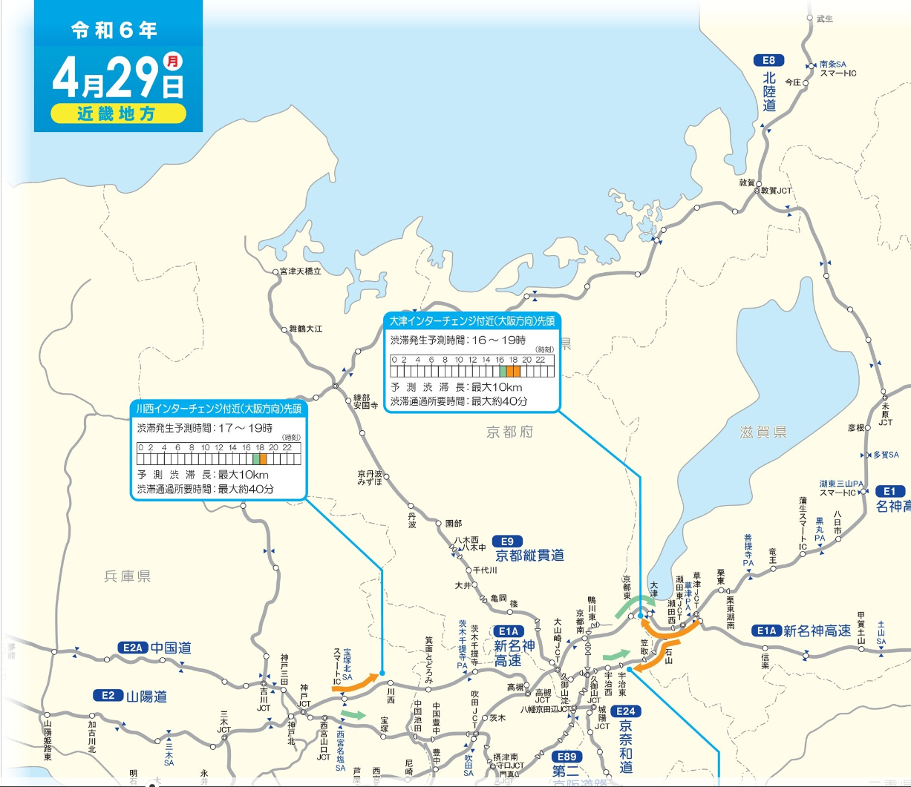

- [DAY1: 2024年4月27日(土)](day1.md)
- [DAY2: 2024年4月28日(日)](day2.md)
- [DAY3: 2024年4月29日(月・祝)](day3.md)

---

# DAY3: 2024年4月29日(月・祝)

    
    

# 午前

- 朝食ビュッフェを食べて出発

## [彦根城](https://hikonecastle.com/)

ホテルから [🚗5km](https://maps.app.goo.gl/WJGAQwjroPGZFTpr5)

    
    

# 昼食

- 未定

# 午後

## [滋賀県立琵琶湖博物館](https://www.biwahaku.jp/)

    
    
    

- 彦根城から[琵琶湖岸沿いの下道で🚗46~49km または 名神高速で🚗60km](https://maps.app.goo.gl/zW165X12GwsugdNA6)

## 帰宅 

- 琵琶湖博物館から[🚗64km](https://maps.app.goo.gl/PmcXUnbaHSzHyMX57)
- 3連休最終日なので渋滞が予測される（特に大津あたり）
    - 観光は彦根城か琵琶湖博物館のどちらかだけにして早めに帰路についたほうがいいかも

---

- [DAY1: 2024年4月27日(土)](day1.md)
- [DAY2: 2024年4月28日(日)](day2.md)
- [DAY3: 2024年4月29日(月・祝)](day3.md)