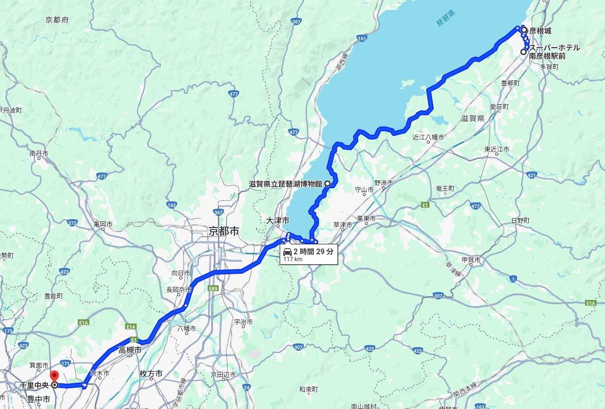
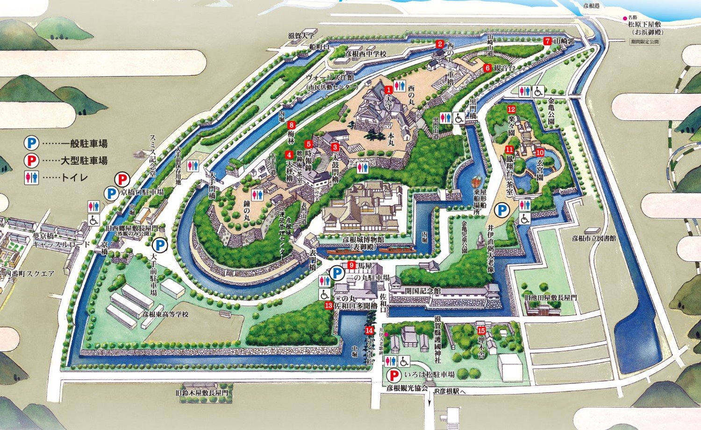
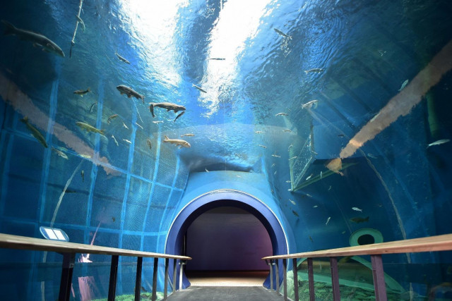

- [DAY1: 2024年4月27日(土)](day1.md)
- [DAY2: 2024年4月28日(日)](day2.md)
- [DAY3: 2024年4月29日(月・祝)](day3.md)

---

# DAY3: 2024年4月29日(月・祝)

# 午前

- 朝食ビュッフェを食べて出発

## [彦根城](https://hikonecastle.com/)

ホテルから🚗5km

    
    

# 昼食

- 未定

# 午後

## [滋賀県立琵琶湖博物館](https://www.biwahaku.jp/)

    
    
    

- 彦根城から
    - 琵琶湖岸沿いの下道で🚗50km
    - 名神高速で🚗60km

## 帰宅 

- 琵琶湖博物館から64km
- 3連休最終日なので夕方は渋滞するかも

---

- [DAY1: 2024年4月27日(土)](day1.md)
- [DAY2: 2024年4月28日(日)](day2.md)
- [DAY3: 2024年4月29日(月・祝)](day3.md)