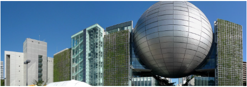
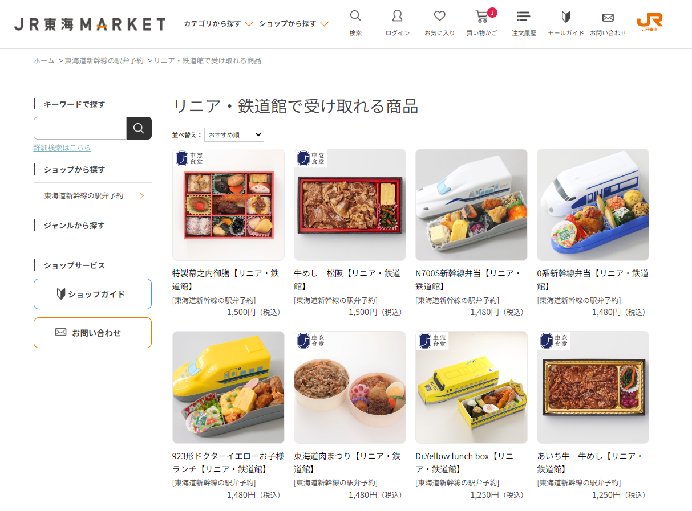

- [DAY1: 2024年7月28日(日)](day1.md)
- [DAY2: 2024年7月29日(月)](day2.md)
- [DAY3: 2024年7月30日(火)](day3.md)
- [DAY4: 2024年7月31日(水)](day4.md)

---

# DAY1: 2024年7月28日(日)

## 新大阪->名古屋

- 初めての東海道新幹線を楽しみにしてるので早めにホームにいって新幹線を眺める
- きっぷの受取には、「受取コード」と「パスワード」が必要
    - [スマートEX](https://shinkansen2.jr-central.co.jp/RSV_P/S_smart_index.htm)

```
乗車日　2024年7月28日
新大阪(09:06)→のぞみ4号→名古屋(09:55)
N700S系16両　
おとな1名  こども1名
```

## 名古屋駅->名古屋市科学館

- 駅で昼食買っていく？
- 地下鉄の場合
    - 科学館最寄りの伏見駅へは名古屋駅から地下鉄東山線、藤が丘行きで1駅
    - 伏見駅からは4・5番出口を出て科学館まで徒歩600m
- 荷物多いし暑いし名古屋駅からタクシーがいいかも

# [名古屋市科学館](http://www.ncsm.city.nagoya.jp/)

<center></center>

- 月曜休館
- 開館時間 9:30～17：00
- 再入館可能
    - 観覧券を提示していただきますのでお手元にご用意ください
- コインロッカーあり
    - コイン返却式。100円玉が必要。
    - スーツケースなどに使用できるちょっと大きめのロッカーもある（2016年情報）
- 入館券(プラネタリウム座席予約含む)購入済み

```
■ご購入内容
-----------------------------------------
常設展示室とプラネタリウム
[来館日] 2024年07月28日（日）
[投影回] 第4回 14:00 ～ 14:50 👨‍👩‍👦ファミリーアワー🧑🏻👨‍👩‍👧‍👦小さなお子様にも楽しんでいただけるプログラムです
[場所] プラネタリウム
[プラネタリウム観覧座席] F56/F57
[区分・枚数・料金]
一般：¥800 × 1枚
未就学児(5歳以上)：¥0 × 1枚
料金小計：¥800（税込み）
-----------------------------------------
料金合計：¥800（税込み）
-----------------------------------------
プラネタリウムは、投影回の開演時間を過ぎますと、ご入場いただけなくなります。
ご購入された投影回の開演時間の15分前までには天文館6階プラネタリウムドームまでお越しください。

【常設展示室】電子チケットQR
「電子チケットQR」は、科学館エントランスの入館ゲートで読取り、直接ご入館いただけますが、科学館に設置されているKIOSK端末から「QR付紙チケット」へ引き換えてご利用いただくこともできます。

【プラネタリウム】引換QR
ご購入されたプラネタリウムの投影回の開演15分前になりましたら、この「引換QR」を、天文館6階プラネタリウムドームの入口でスタッフへ提示し、ご入場ください。
```



## 昼食

未定

- 館内には休憩室が3ヶ所（席数計350席）あります（持込可）
    - 朝、名古屋駅でおにぎりとか買っていく？
- 科学館の敷地内の別棟にはレストランがあります
    - 土日祝日営業時間　9時30分～18時
    - 館内から直接行くことはできません
    - 理工館１階エントランスホールからいったん外に出てお越しください
    - 再入館される場合は、観覧券を提示して科学館へお入りください

## 夕食

未定

- ホテルに荷物おいてから食べに出かける？

## 科学館->ホテル

荷物多いけど徒歩+電車？

# [スーパーホテル　名古屋駅前](https://www.superhotel.co.jp/s_hotels/nagoya/)

〒453-0013　愛知県名古屋市中村区亀島2-12-6

- 朝食時間 6:30～9:00
- コインランドリー（有料）24時間利用可 洗濯用洗剤無料

---

- [DAY1: 2024年7月28日(日)](day1.md)
- [DAY2: 2024年7月29日(月)](day2.md)
- [DAY3: 2024年7月30日(火)](day3.md)
- [DAY4: 2024年7月31日(水)](day4.md)