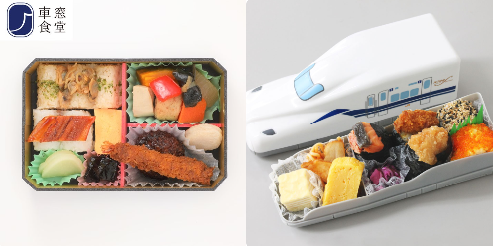

- [DAY1: 2024年7月28日(日)](day1.md)
- [DAY2: 2024年7月29日(月)](day2.md)
- [DAY3: 2024年7月30日(火)](day3.md)
- [DAY4: 2024年7月31日(水)](day4.md)

---

# DAY2: 2024年7月29日(月)

## 朝食

- ホテルで和食ビュッフェ 6:30～9:00
- 9:00からホテルのウォーター･プレイ･エリア受付開始なので予約を忘れずに
    - 9:00からは15:30／16:30／17:30の回が予約できる
        - 15:30と16:30の回は混むらしい
    - 12:00から18:30／19:30／20:30の回が予約できる
        - 水着のまま部屋に移動してもOKなので、夜の入浴とセットにすると楽？
        - 廊下はエアコンきいてて寒いので、帰りは着替えたほうがいいらしい？
- 朝食のあいだに前日分の洗濯する？

## ホテル->リニア・鉄道館

- 電車だと45分
    - あおなみ線の金城ふ頭行きで10駅
    - 徒歩区間も多い
- 車なら30~35分
    - 荷物多いし暑いしタクシーがいいかも
- いったんレゴランド・ジャパン・ホテルに寄って荷物預けてから行くのもあり
    - ホテルからリニア・鉄道館は徒歩600m

# [リニア・鉄道館](https://museum.jr-central.co.jp/)


- 火曜休館
- 開館時間 10：00～17：30
- 入館券購入済み

```
■ チケット
   ◇オンライン入館券
     2024年07月29日(月)
     オンライン入館券　大人 / 1,000 円 × 1 枚
     2024年07月29日(月)
     オンライン入館券　幼児 / 200 円 × 1 枚
```

- 各種シミュレータの利用券は先着順で販売
    - 「混雑が見込まれる時は、開館前に整理券を配布する場合があります。」
- 新幹線シミュレータ「N700」、在来線シミュレータ「車掌」のご利用券はお一人様または1グループにつきどちらか1枚のみ

<center></center>

## 昼食

- [あらかじめ注文しておいた駅弁](https://market.jr-central.co.jp/shop/customer/historydetail.aspx?order_id=JC240720-039528826)を受け取って昼食にする
- リニア・鉄道館内2階 デリカステーション で11時に受取
- 飲食可能な場所は5ヶ所
    - お昼時間になると座れないこともあるので、早めの席確保がおすすめ
    - 2階
        - デリカステーション
            - 受け取ったその場で食べられる
        - 飲食コーナー
            - 幼児向けの遊ぶスペースもある
        - センターデッキ
            - 車両を眺めながら食べられる人気スポット
    - 1階
        - イベント広場の飲食スペース
            - 新幹線を間近で眺めることができるが席数少なめ
    - 屋外展示
        - N700系車内
            - エアコン完備
            - 子どもが食事をするにはテーブルが狭いのが難点だが空いててガラガラらしい？
            - 一番奥の３号車がグリーン車でおすすめ

<center></center>

## リニア・鉄道館->ホテル

徒歩600m

# [レゴランド・ジャパン・ホテル](https://www.legoland.jp/hotel/)

- 4pm〜 チェックイン可能
    - 朝食の予約が4pmから始まるので早めにチェックインしてQRコードから早めに予約する
- チェックイン前・後も荷物を預かってくれる
- コインランドリー無し、ランドリーサービス無し

## ウォーター･プレイ･エリア

- [予約は当日のみ可能](https://airrsv.net/legolandjapanhotel-wpa/calendar)
- 定員制、時間制(30分制)
- 夕方からのみ開催しており、午前の開催はなし
    - 15:30／16:30／17:30／18:30／19:30／20:30
- 原則、チェックイン日のみのご利用となるため、チェックアウト日はご利用いただけません
- 利用日の午前9：00と午前12：00（正午）よりご予約を承っております

<center></center>

- 更衣室やロッカーのご利用いただけますが、混雑が予想されるため、参加前はお部屋で着替えを済ませていただくことをお勧めしております
- 脱水機のご利用の際は、必ず着替えをお持ちください
    - 再度脱水機のみのご利用はできかねます
- 更衣室内ロッカーに鍵の設置はございません
    - 防犯上、貴重品のお持ち込みもお断りしております
- 写真撮影は可能となりますが、他のお客様・スタッフ等映らないようご配慮お願いいたします
- 入水後、ご利用いただけるタオルをご用意しております。ご使用後更衣室内のタオル回収ボックスへご返却ください。

## キッズプレイエリア (レストラン併設)

- 遊べる時間は 6：00～11：00、16：00～22：00
- ブリックスファミリーレストランのテラスにも遊具とはたらく車がある

<center></center>


## 夕食

- 未定
- 周囲には飲食店ほぼ無し
- ホテル内
    - スカイライン・バー
        - 17:00〜21:00営業
        - 予約は必須ではないが席を確保しておいたほうがいい
            - [公式サイト](https://www.legoland.jp/hotel/restaurants-and-shop/skyline-bar/dinner/)からオンライン予約可
        - プレイエリアに近い
        - コース・単品
    - ブリックス・ファミリー・レストラン
        - 17:30〜21:00営業
        - 予約不要
        - レゴのキャラクターと写真が撮れる
        - この日はミニブッフェ ディナーの設定
            - お好きなメイン1品を選んで頂き、スープ、ピラフ、パン、デザートは食べ放題、ソフトドリンクも飲み放題のディナーです。（予約不要）
            - フルブッフェ ディナーや平日限定メニュー ディナープレートはこの日は開催なし

<center></center>

## ホテルショップ

- 9:00～11:30と15:00～20:00に営業
- お土産買っちゃってもいいかも

---

- [DAY1: 2024年7月28日(日)](day1.md)
- [DAY2: 2024年7月29日(月)](day2.md)
- [DAY3: 2024年7月30日(火)](day3.md)
- [DAY4: 2024年7月31日(水)](day4.md)