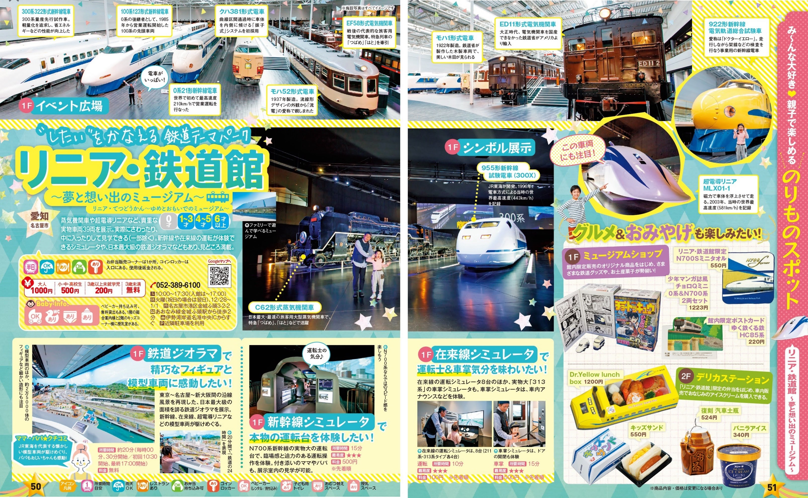
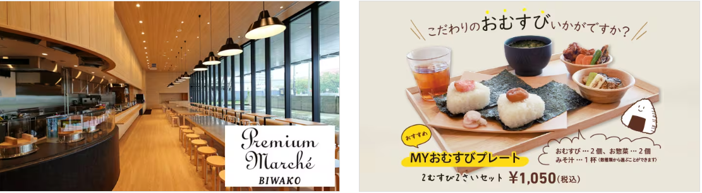
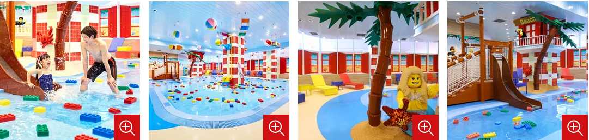

- [DAY1: 2024年7月28日(日)](day1.md)
- [DAY2: 2024年7月29日(月)](day2.md)
- [DAY3: 2024年7月30日(火)](day3.md)
- [DAY4: 2024年7月31日(水)](day4.md)

---

# DAY2: 2024年7月29日(月)

## 朝食

- ホテルで和食ビュッフェ 6:30～9:00
- 9:00からホテルのウォーター･プレイ･エリア受付開始なので予約を忘れずに

## ホテル->リニア・鉄道館

- 電車だと徒歩も多く、所要45分
    - あおなみ線の金城ふ頭行きで10駅
- 車なら30~35分
    - タクシーがいいかも

# [リニア・鉄道館](https://museum.jr-central.co.jp/)

<center></center>

- 火曜休館
- 開館時間 10：00～17：30
- 入館券購入済み

```
■ チケット
   ◇オンライン入館券
     2024年07月29日(月)
     オンライン入館券　大人 / 1,000 円 × 1 枚
     2024年07月29日(月)
     オンライン入館券　幼児 / 200 円 × 1 枚
```

- 各種シミュレータの利用券は先着順で販売
    - 「混雑が見込まれる時は、開館前に整理券を配布する場合があります。」
- 新幹線シミュレータ「N700」、在来線シミュレータ「車掌」のご利用券はお一人様または1グループにつきどちらか1枚のみ

<center></center>

## 昼食

- [あらかじめ注文しておいた駅弁](https://market.jr-central.co.jp/shop/customer/historydetail.aspx?order_id=JC240720-039528826)を受け取って昼食にする
- リニア・鉄道館内2階 デリカステーション で11時に受取

<center></center>

## リニア・鉄道館->ホテル

徒歩600m

# [レゴランド・ジャパン・ホテル](https://www.legoland.jp/hotel/)


- チェックイン前・後も荷物を預かってくれる

## ウォーター･プレイ･エリア

- [予約は当日のみ可能](https://airrsv.net/legolandjapanhotel-wpa/calendar)
- 定員制、時間制(30分制)
- 夕方からのみ開催しており、午前の開催はなし
- 原則、チェックイン日のみのご利用となるため、チェックアウト日はご利用いただけません
- 利用日の午前9：00と午前12：00（正午）よりご予約を承っております

<center></center>

- 更衣室やロッカーのご利用いただけますが、混雑が予想されるため、参加前はお部屋で着替えを済ませていただくことをお勧めしております
- 脱水機のご利用の際は、必ず着替えをお持ちください。再度脱水機のみのご利用はできかねます。
- 更衣室内ロッカーに鍵の設置はございません。防犯上、貴重品のお持ち込みもお断りしております。
- 写真撮影は可能となりますが、他のお客様・スタッフ等映らないようご配慮お願いいたします
- 入水後、ご利用いただけるタオルをご用意しております。ご使用後更衣室内のタオル回収ボックスへご返却ください。

## キッズプレイエリア (レストラン併設)

<center></center>


## 夕食

- 未定
- ホテルのブリックス・ファミリー・レストランはこの日はミニブッフェ ディナーの設定
    - お好きなメイン1品を選んで頂き、スープ、ピラフ、パン、デザートは食べ放題、ソフトドリンクも飲み放題のディナーです。（予約不要）
- フルブッフェ ディナーや平日限定メニュー ディナープレートはこの日は開催なし

<center></center>

---

- [DAY1: 2024年7月28日(日)](day1.md)
- [DAY2: 2024年7月29日(月)](day2.md)
- [DAY3: 2024年7月30日(火)](day3.md)
- [DAY4: 2024年7月31日(水)](day4.md)