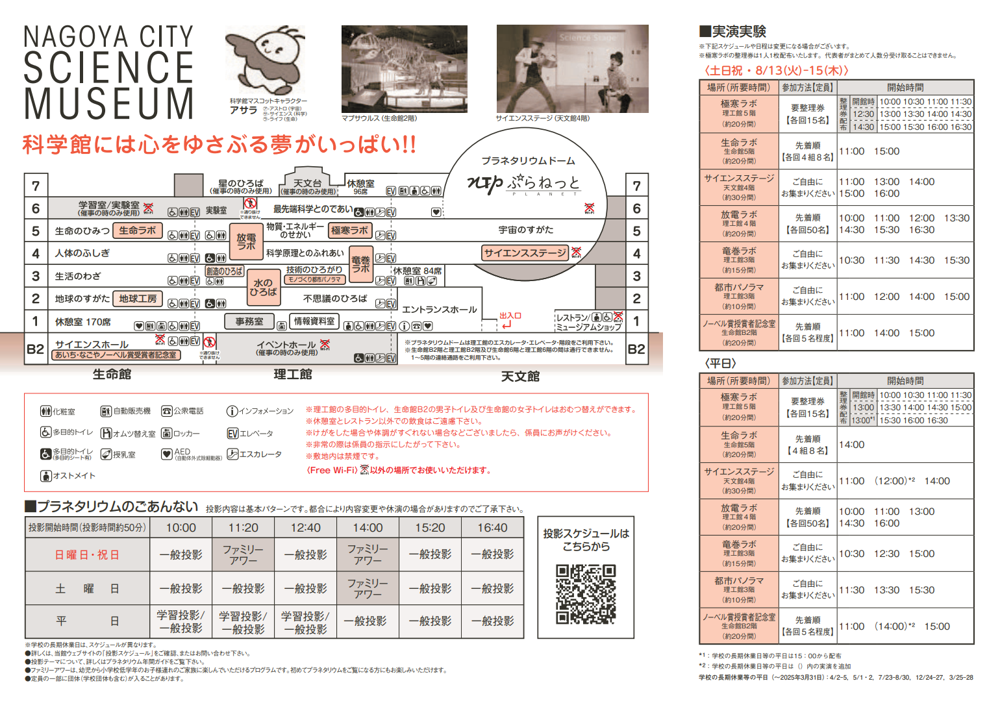

- [DAY1: 2024年7月28日(日)](day1.md)
- [DAY2: 2024年7月29日(月)](day2.md)
- [DAY3: 2024年7月30日(火)](day3.md)
- [DAY4: 2024年7月31日(水)](day4.md)

---

# DAY1: 2024年7月29日(月)

# [リニア・鉄道館](https://museum.jr-central.co.jp/)

- 火曜休館
- 開館時間 10：00～17：30
- オンライン入館券あり
- 各種シミュレータの利用券は先着順で販売
- [あらかじめ注文しておいた駅弁](https://market.jr-central.co.jp/shop/e/eCPRINIA/)を受け取って昼食にする



# [レゴランド・ジャパン・ホテル](https://www.legoland.jp/hotel/)


- チェックイン前・後も荷物を預かってくれる
- レゴブロックがいっぱいのウォーター･プレイ･エリア
    - [予約は当日のみ可能](https://airrsv.net/legolandjapanhotel-wpa/calendar)
- レストランに併設されたキッズプレイエリア

```
※ご利用日の午前9：00と午前12：00（正午）よりご予約を承っております。
※ご予約はホテル予約の代表者様のお名前で承ります。

■ウォーター・プレイ・エリアは、定員制、時間制(30分制)です。
■毎日夕方からのみ開催しており、午前の開催はございません。
■原則、チェックイン日のみのご利用となるため、チェックアウト日はご利用いただけません。
```

```
ご利用に関して
※ご参加前の必読事項でございます。下記内容ご承諾の上、ご参加ください。
■更衣室やロッカーのご利用いただけますが、混雑が予想されるため、参加前はお部屋で着替えを済ませていただくことをお勧めしております。
■脱水機のご利用の際は、必ず着替えをお持ちください。再度脱水機のみのご利用はできかねます。
■3歳以下のお子様一名につき保護者の方一名のご入水が必要となります。
■3歳以下のお子様でおむつを着用されているお子様は必ず水遊び用おむつと水着の重ね履きをしていただき、ご利用ください。
■更衣室内ロッカーに鍵の設置はございません。防犯上、貴重品のお持ち込みもお断りしております。(紛失・盗難などがありましても当ホテルは一切の責任を負いかねます。)
■写真撮影は可能となりますが、他のお客様・スタッフ等映らないようご配慮お願いいたします。(スタッフは安全のための監視員となるため、撮影等のご協力はお断りしております。)
■設置しております見学用の椅子は限りがありますので、ご了承ください。
■入水後、ご利用いただけるタオルをご用意しております。ご使用後更衣室内のタオル回収ボックスへご返却ください。
■各回終了時刻10分後から更衣室内に清掃が入ります。
　(例:15:30～の回の場合　16:10～清掃)
```

---

- [DAY1: 2024年7月28日(日)](day1.md)
- [DAY2: 2024年7月29日(月)](day2.md)
- [DAY3: 2024年7月30日(火)](day3.md)
- [DAY4: 2024年7月31日(水)](day4.md)