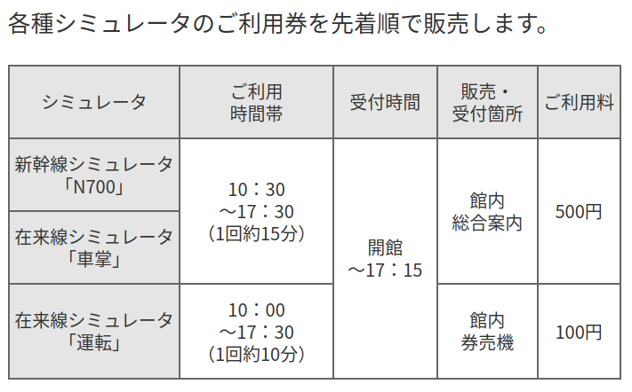
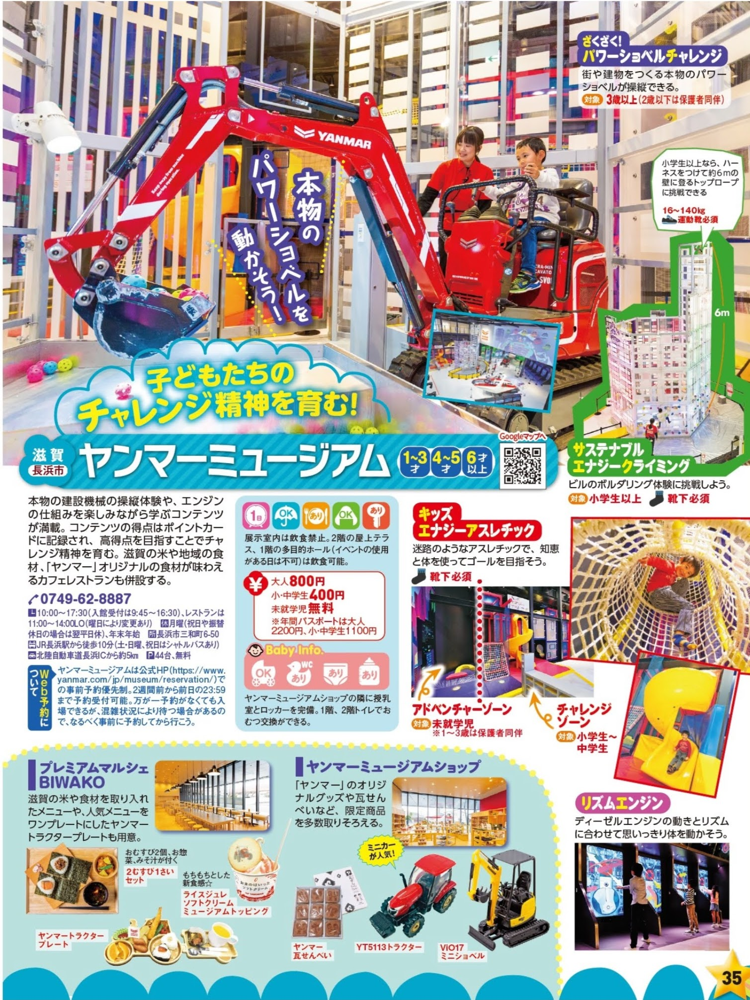

- [DAY1: 2024年7月29日(月)](day1.md)
- [DAY2: 2024年7月30日(火)](day2.md)
- [DAY3: 2024年7月31日(水)](day3.md)

---

# DAY3: 2024年7月31日(水)




# [ヤンマーミュージアム](https://www.yanmar.com/jp/museum/)

- 月曜休館
- チケットの入場時間が15分単位



# 昼食

- ヤンマーミュージアム併設カフェで
- 混雑するらしいので早めに

<div style="text-align: center;">
    
    
    
</div>

```
【平日】11:00～14:30（ラストオーダー 14:00）
【土日祝日】11:00～17:00（ランチラストオーダー 15:00 / カフェラストオーダー 16:30）
```


---

- [DAY1: 2024年7月29日(月)](day1.md)
- [DAY2: 2024年7月30日(火)](day2.md)
- [DAY3: 2024年7月31日(水)](day3.md)