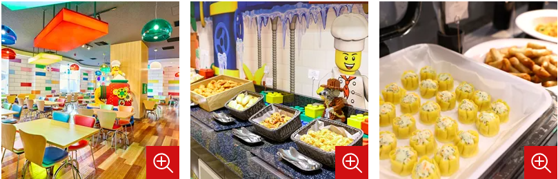

- [DAY1: 2024年7月28日(日)](day1.md)
- [DAY2: 2024年7月29日(月)](day2.md)
- [DAY3: 2024年7月30日(火)](day3.md)
- [DAY4: 2024年7月31日(水)](day4.md)

---

# DAY3: 2024年7月30日(火)

## 朝食

- ブリックス･ファミリー･レストラン(２階)でブッフェ
- この日は営業7:00〜

- ウォーターアトラクション午前枠の予約が8:00から始まるので、もし午前枠を利用するなら忘れずに
    - 予約は本当に一瞬で埋まるらしいのでとりあえず午前予約をトライするといい？
    - 早い時間の方からみるみる予約が埋まっていくので、遅い時間枠は「早い時間枠を取れなかった人」が後から流れてくるらしい
        - なので、最初から遅い時間枠を狙うと、意外とあっさり予約を取れたりする？
    - 予約とれなかった場合は、グッズをお土産として購入し、入場確約特典に課金するのもアリ
        - 一番安いのはタオルで1500円
        - 購入するグッズは1点でも、入場確約権は複数買える（1枚500円）
        - ウォーターメイズとスプラッシュパッドの両方の予約枠を買うなら、入場確約権は倍の料金
- パーク内で着替えるのは面倒&時間がもったいないので、水着きて入場して早めの枠で遊ぶ？
- コインロッカー用に100円玉4枚用意しておく

## チェックアウト

- チェックアウトしても荷物はコンシェルジュデスクやフロントデスク、ホテルの入り口横で預かってくれるので預けるのもあり
- チェックアウトは11時ですが、レゴランドが開園する10時前後からフロントは混み合います

# [レゴランド・ジャパン](https://www.legoland.jp/)

- 1日フルに遊ぶ
- この日の営業 10:00～18:00
- ホテル宿泊者は開園時に優先レーン（プライオリティーレーン）を利用できる
- [アトラクション](https://www.legoland.jp/resort-guide/legoland/attractions/)
- 土産買う？
    - 家族に
    - 実家に
    - 金沢のレゴ好きさんにも

## [水着で楽しむ２つのウォーターアトラクション](https://www.legoland.jp/operation/seasonal-events/summer/2024/water-attractions/)

- ウォーター･メイズは1時間ごと、スプラッシュ･パッドは30分ごとの入替制
- 当日ウェブページで受付
    - 午前枠は8:00～受付
    - 午後枠は11:00～受付
    - 何度も着替えたくないので、隣接した時間枠を確保したい
        - スプラッシュ･パッド10:30-11:10からのウォーター･メイズ11:20-12:20とか
        - スプラッシュ･パッド13:30-14:10からのウォーター･メイズ14:20-15:20とか
- 水遊び場の中にトイレはなく、プール内で水分補給もできないので、あらかじめ済ませてから入場しましょう
- スプラッシュバトルというアトラクションもほぼ確実に濡れる（水着着用は自由）らしいので、水着着てるうちに行く
    - 他にも濡れる&水着着用可のアトラクションはいくつもあるらしい

### ウォーター･メイズ

- アトラクションを利用する方は大人も含め水着の着用が必要です
- エリア内は裸足でのご利用をお願いします
- 1時間ごと入れ替え

### スプラッシュ・パッド

- スライダーを利用する方は大人も含め水着の着用が必要です
- エリア内は裸足でのご利用をお願いします
- 30分ごと入れ替え

### 更衣室・ロッカー

- コインロッカー(400円)は各更衣室に設置しております
- 6歳以下のお子様は男性更衣室・女性更衣室どちらもご利用できます
- ロッカーの数は十分にあるので、「早く行かないと埋まってしまう」ということはない

## 昼食

- 持ち込み禁止
- レゴランド内のレストランは5ヶ所
    - どこも11時オープン
    - 混むらしい
- 和食レストラン彩
    - 2023年3月にオープンした一番新しいレストラン
    - 唯一、店内にレゴブロックプールがある
    - レゴランド公式にて、1DAYパスポート・コンボ1DAYパスポート・年間パスポート（プレミアム・スタンダード）を購入したかたのみ優先予約ができます。
    - 予約は前日まで
        - 7月11日、チケット購入したので予約を試みたがバーコード番号が無効と言われてできなかった。JAF割引を利用したからか？

## 夕食

- レゴランド近くの[メイカーズピア](https://www.makerspier.com/)で食べる?
    - あまり行きたい店がない
- 水着など洗濯したいので、ホテルチェックインして洗濯開始してから近くで食べる？

## レゴランド->ホテル

- 電車だと45分
    - あおなみ線の金城ふ頭行きで10駅
    - 徒歩区間も多い
- 車なら30~35分
    - 荷物多いし暑いしタクシーがいいかも

# [スーパーホテル　名古屋駅前](https://www.superhotel.co.jp/s_hotels/nagoya/)

〒453-0013　愛知県名古屋市中村区亀島2-12-6

- 朝食時間 6:30～9:00
- コインランドリー（有料）24時間利用可 洗濯用洗剤無料

---

- [DAY1: 2024年7月28日(日)](day1.md)
- [DAY2: 2024年7月29日(月)](day2.md)
- [DAY3: 2024年7月30日(火)](day3.md)
- [DAY4: 2024年7月31日(水)](day4.md)