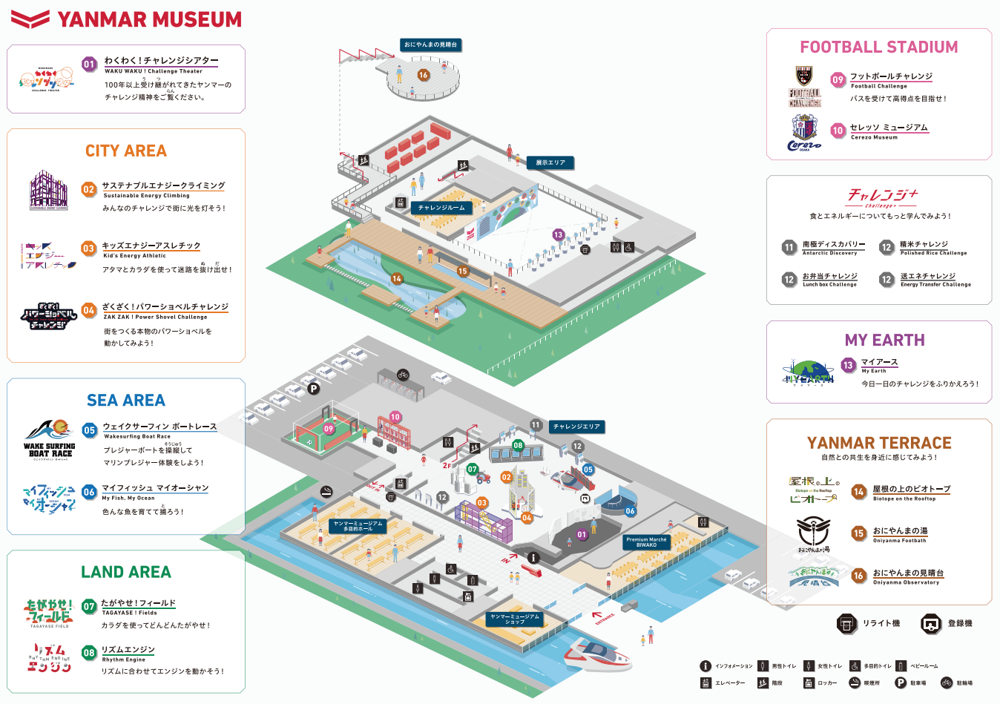

- [DAY1: 2024年7月28日(日)](day1.md)
- [DAY2: 2024年7月29日(月)](day2.md)
- [DAY3: 2024年7月30日(火)](day3.md)
- [DAY4: 2024年7月31日(水)](day4.md)

---

# DAY4: 2024年7月31日(水)

## 朝食

- ホテルで和食ビュッフェ 6:30～9:00

# 移動

- 早めにホームにいって新幹線を眺める

```
■利用列車・経路の詳細
　●名古屋
　09:19発
　｜ 新幹線ひかり６３３号
　09:47着
　○米原<乗換9分>
　09:56発
　｜ 特急しらさぎ３号
　10:02着
　●長浜
```

## 長浜駅->ヤンマーミュージアム

- 1km、歩けるか？
- いずれにせよ大きな荷物は長浜駅のコインロッカーに預けたほうがいいかも
    - 長浜駅西口側にコインロッカーあり
        - ICカード使えないので100円玉が3〜6枚必要
    - ヤンマーミュージアムのロッカーは少ない&小さい

# [ヤンマーミュージアム](https://www.yanmar.com/jp/museum/)


- 月曜休館
- チケット購入済み。入場時間15分単位

```
■ チケット
   ◇Web入館予約券
     2024年07月31日(水) 10:45
     Web)入館予約券　個人一般（プログラム） / 900 円 × 1 枚
     2024年07月31日(水) 10:45
     Web)入館予約券　個人未就学児 / 0 円 × 1 枚
```

- 1階エントランスにロッカーがございます。（暗証番号式／無料）
    - ロッカーの数に限りがございますので、なるべく少ない荷物でご来館下さい
    - 大型の荷物(スーツケース等)がある場合は、受付窓口にご相談ください
- [アトラクション一覧](https://www.yanmar.com/jp/museum/facilities/guide.html)
- [ミュージアムショップ](https://www.yanmar.com/jp/museum/facilities/museum_shop.html)
    - 自分用にトラクター買いたい ヤンマートラクター YT5113 ￥550（税込）
    - こどもたちにTシャツいいかも ￥2,000（税込）



## 昼食

- ヤンマーミュージアム併設カフェで
    - [Premium Marché BIWAKO](https://www.yanmar.com/jp/museum/facilities/premium_marche.html)
- 混雑するらしいので早めに


- 【平日】11:00～14:30（ラストオーダー 14:00）
- 【土日祝日】11:00～17:00（ランチラストオーダー 15:00 / カフェラストオーダー 16:30）


## 移動

```
■利用列車・経路の詳細
　●長浜
　16:02発
　｜ 特急しらさぎ５７号
　16:27着
　○敦賀<乗換12分>
　16:39発
　｜ 新幹線つるぎ３０号
　17:00着
　●福井
```

---

- [DAY1: 2024年7月28日(日)](day1.md)
- [DAY2: 2024年7月29日(月)](day2.md)
- [DAY3: 2024年7月30日(火)](day3.md)
- [DAY4: 2024年7月31日(水)](day4.md)