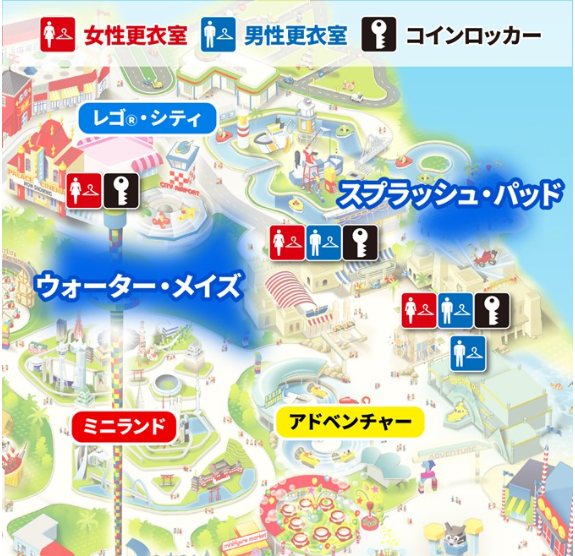

# [ヤンマーミュージアム](https://www.yanmar.com/jp/museum/)

- 自宅付近から [🚗126km](https://maps.app.goo.gl/VzisRGZku8krRBHB6)
- 駐車場44台 無料
- 10am-2pmの約4時間滞在予定


```
滋賀県長浜市三和町6-50
TEL: 0749-62-8887 / FAX: 0749-62-8780

≪土日祝日≫
10:00-17:30（受付 9:45-16:30）※最終入館17:00
```


# 昼食

- ヤンマーミュージアム併設カフェで
- 土日は混雑するらしいので早めに

<div style="text-align: center;">
    
    
    
</div>

```
【平日】11:00～14:30（ラストオーダー 14:00）
【土日祝日】11:00～17:00（ランチラストオーダー 15:00 / カフェラストオーダー 16:30）
```