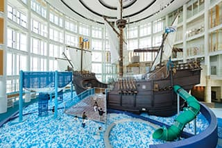
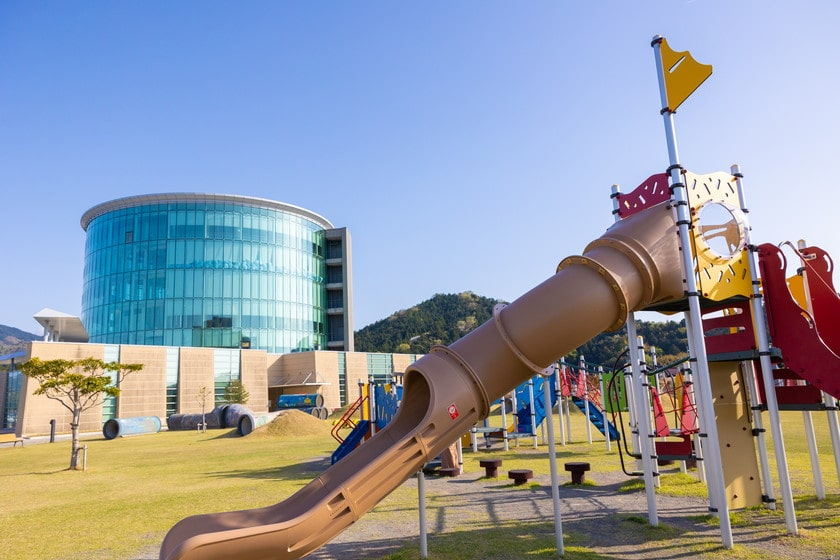
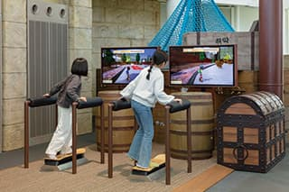
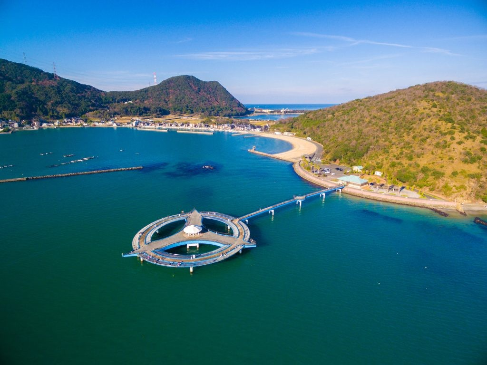
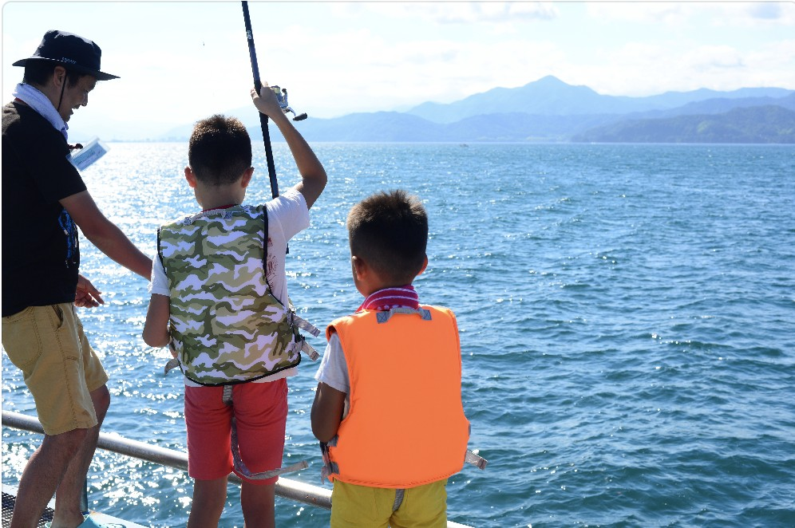
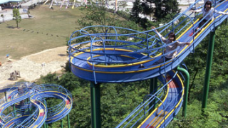
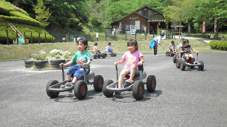
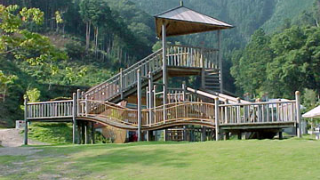
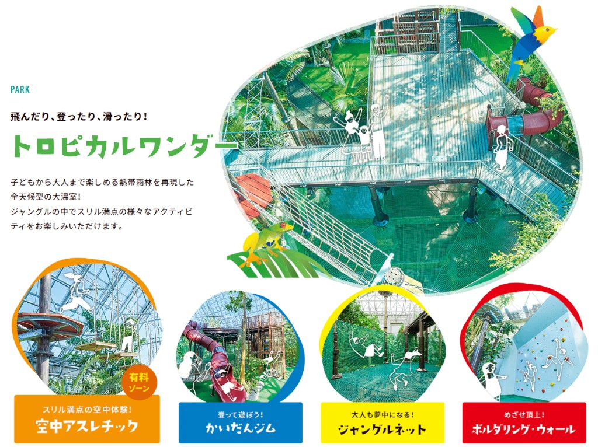
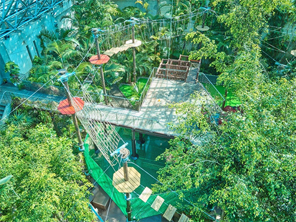

- [DAY1: 2026年5月17日(日)](day1.md)
- [DAY2: 2026年5月18日(月)](day2.md)

---

# DAY1: 2026年5月17日(日)

- 7:00〜8:00 千里中央 出発
- [ルート：名神高速 → 京都縦貫道 → 舞鶴若狭道 → 大飯高浜IC → おおい町](https://maps.app.goo.gl/cNXVnmR6ZfPLmSK48)
- 所要時間：約2時間（約145km）

## [福井県こども家族館](https://www.kodomokazokukan.jp/)

- [📍福井県大飯郡おおい町成海1-1-1（うみんぴあ大飯内）](https://maps.app.goo.gl/UTRCLG7BbLBu5Bfq5)

- <p>
    
    
    
  </p>

> **⚠️月曜休館のため、必ずDAY1（日曜）に訪問すること**

- 9:30 開館に合わせて到着できるとベスト
- 関西万博の恐竜体験ゾーンは事前予約不可のため、到着後すぐに申込?
  - 午前の部：①10:00〜 ②10:30〜 ③11:00〜 ④11:30〜
  - できれば①か②の回を狙う

- 利用案内（抜粋）：[ご利用案内](https://www.kodomokazokukan.jp/guide)
  - 開館時間：9:30〜17:00（あそび探検ゾーン最終入館 16:30）
  - 休館日：月曜日（祝日除く）／祝日の翌日（※土日祝除く）／年末年始（12/29〜1/3）
  - 入館料：館内1階・4階は無料（2〜3階「あそび探検ゾーン」、1階「恐竜体験ゾーン」は有料）
    - 個人：大人 320円／小中高生 150円／未就学児 無料（未就学児同伴の保護者は有料）
  - 駐車場：普通車70台／大型車10台／身障者用4台（無料）

---

## 嶺南エリア 寄り道候補

こども家族館の前後に時間・天気が合えば：

- [あかぐり海釣公園](https://www.town.ohi.fukui.jp/1003/64/p10033.html)：釣り用具レンタルあり ☀️晴れ限定
  - [📍〒919-2101 福井県大飯郡おおい町大島２１−１１０](https://maps.app.goo.gl/wL6A261CeUx7TzkJA)
  - <p>
      
      
    </p>
- [きのこの森](https://www.wakasa-ohi.co.jp/?page_id=168)：全長460mのビッグスライダー、ムーンカート ☀️晴れ限定
  - [📍〒919-2123 福井県大飯郡おおい町鹿野42-27](https://maps.app.goo.gl/BdTNGvZkkTEEjbvW6)
  - <p>
      
      
      
    </p>
- [若狭たかはまエルどらんど](https://www.kepco.co.jp/corporate/profile/community/pr/eldoland/index.html)：科学展示、屋内アスレチック ⚠️ 月曜休館
  - [📍〒919-2204 福井県大飯郡高浜町青戸４−１](https://maps.app.goo.gl/kp86NjyTkE4j3X75A)
  - <p>
      
      
    </p>

---

# 昼食

- おおい町・高浜周辺で海鮮（要調査）

---

# 移動

- 昼食後、青雲閣へ（おおい町→あわら市、約120km・約2時間）
- [ルート：小浜 → 敦賀 → 北陸道 → 金津IC → あわら市](https://maps.app.goo.gl/A8KeTgL1Ephst9ZV7)
- 15:00 チェックイン目標

---

# [大江戸温泉物語Premium 青雲閣](https://www.ooedoonsen.jp/seiunkaku/)

- [📍〒910-4103 福井県あわら市二面68-1](https://maps.app.goo.gl/AHyqxhc9MWEH1AK8A)

```
チェックイン日時：2026年5月17日（日） 15:00〜19:00
部屋タイプ　　　：【禁煙】スーペリア洋室フォース 恐竜ルーム
食事　　　　　　：夕食・朝食（バイキング、ハーゲンダッツアイスクリームなど食べ放題）
```

- 恐竜ルームをたっぷり楽しむ
- 屋内キッズパーク（アスレチック）で遊ぶ
- 温泉・夕食バイキングを満喫

---

- [DAY1: 2026年5月17日(日)](day1.md)
- [DAY2: 2026年5月18日(月)](day2.md)
