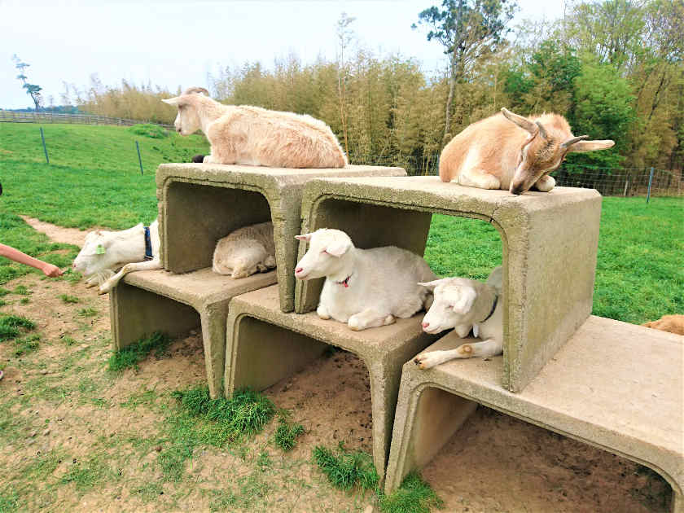
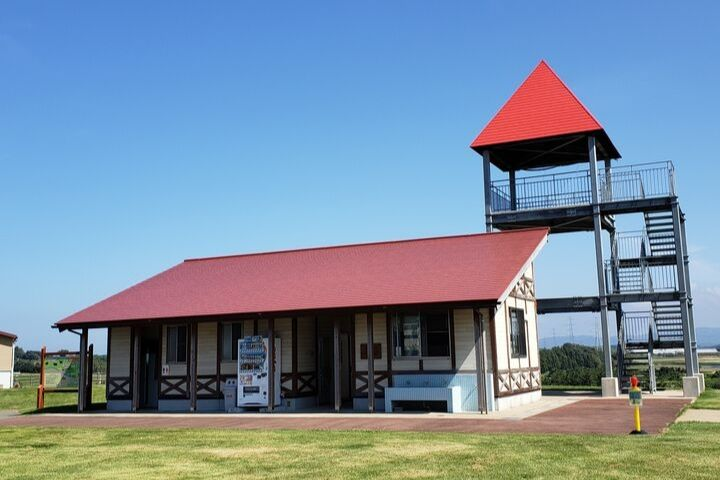
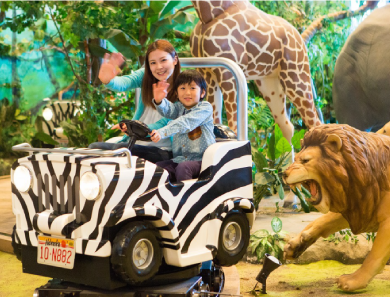
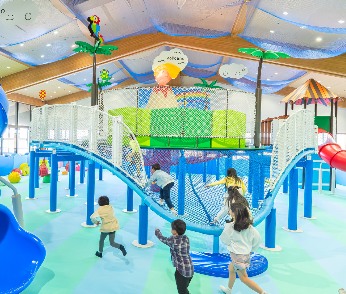
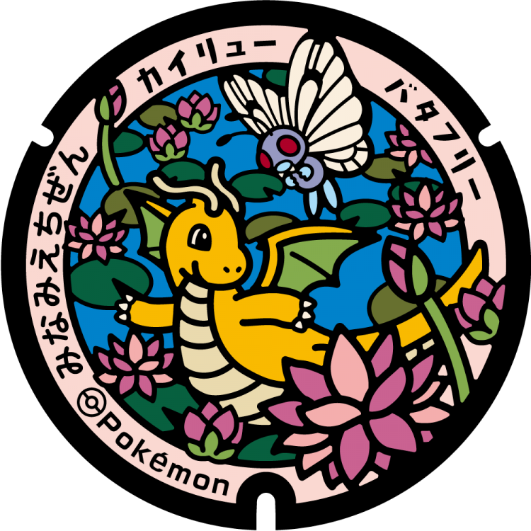

- [DAY1: 2026年5月17日(日)](day1.md)
- [DAY2: 2026年5月18日(月)](day2.md)

---

# DAY2: 2026年5月18日(月)

# 午前

- 朝食バイキングをゆっくり食べて出発
- 11:00 チェックアウト

---

## 嶺北エリア 寄り道候補

- [なかよしとんがり牧場](https://www.fuku-iku.jp/asobiba/p000000zzzzo.html) ☀️晴れ限定
  - [📍〒913-0004 福井県坂井市三国町平山](https://maps.app.goo.gl/4woEH32m5Tx37N5A8)
  - 

      
      
    

- [芝政ワールド](https://shibamasa.com/sp/index.php)（屋内も屋外もあり）
  - [📍〒913-0005 福井県坂井市三国町浜地４５](https://maps.app.goo.gl/THQr954vkpTfuhbQA)
  - 

      
      
      
    

- 東尋坊
- 三国港・三国サンセットビーチ周辺の散歩

---

# 昼食

- 三国港周辺で海鮮（要調査）

---

# ポケふた（できれば・帰路）

- [ポケふた #366（えちぜんエリア）](https://local.pokemon.jp/manhole/desc/366/) を帰路で寄れたら
  - カイリュー・バタフリー
  - 南条SA(上り)併設の道の駅 南えちぜん山海里にあるらしい

---

# 帰路

- 14:00 千里中央へ向けて出発
- [ルート：北陸道 → 米原JCT → 名神 → 千里中央](https://maps.app.goo.gl/wHZ7v6WP55jq7frW9)
- 17:00 千里中央 着

---

- [DAY1: 2026年5月17日(日)](day1.md)
- [DAY2: 2026年5月18日(月)](day2.md)
